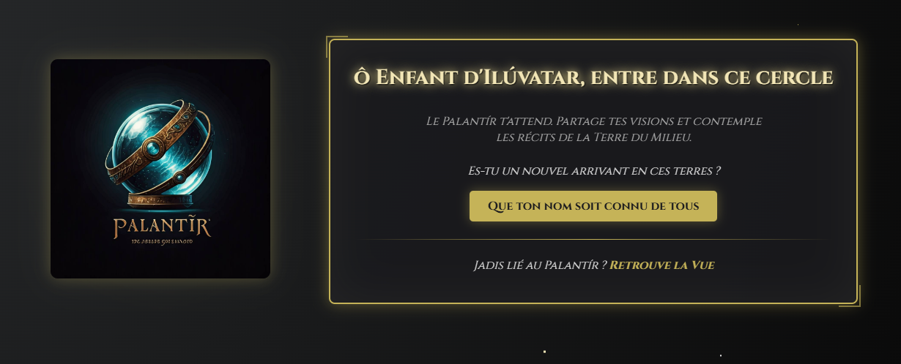

# Projet Palantír

Ce projet est une simulation front-end d’un réseau social sur le thème du Seigneur des anneaux, développée en **HTML**, **CSS** et **JavaScript**.  
Il contient plusieurs pages et scripts qui reproduisent le comportement d’un réseau social côté client.

## ✨ Fonctionnalités

- Page d’accueil (`accueil.html`)
- Navigation entre différentes pages
- Affichage de posts
- Ajout de publications (simulé)
- Ajout d'ami (simulé)
- Interface responsive (selon les styles appliqués)

## 🚀 Lancer le projet

1. Clonez le dépôt :

```bash
git clone https://github.com/Lucky31-tou/Palantir.git
```
2. Ouvrir le fichier acceuil.html dans votre navigateur

## 📁 Structure du projet
Le projet contient :
- Plusieurs fichiers HTML pour les différentes interfaces
- Plusieurs fichiers CSS pour le style
- Des scripts JavaScript pour la logique
- Plusieurs sous-dossiers pour les différents styles

## 📷 Aperçu



Louis Lucky
